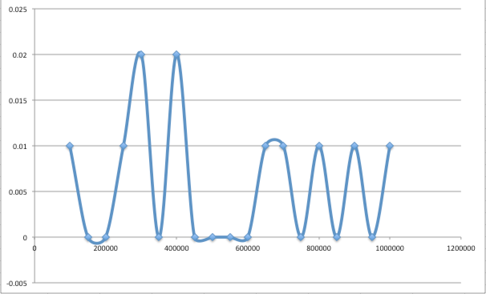
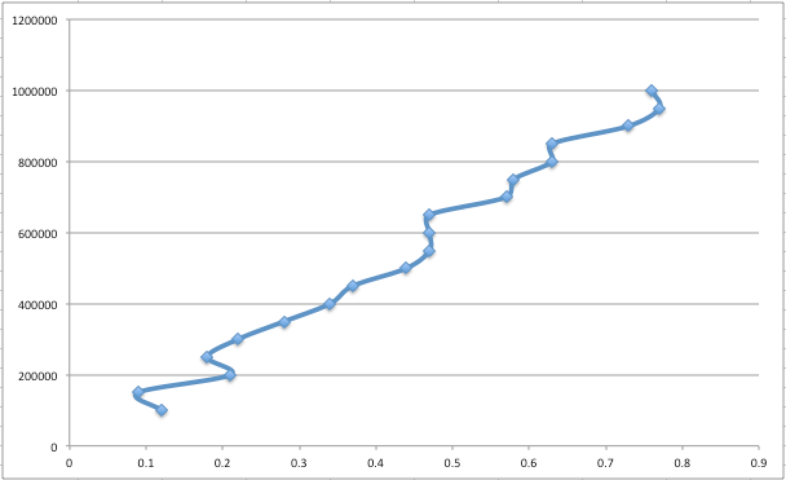
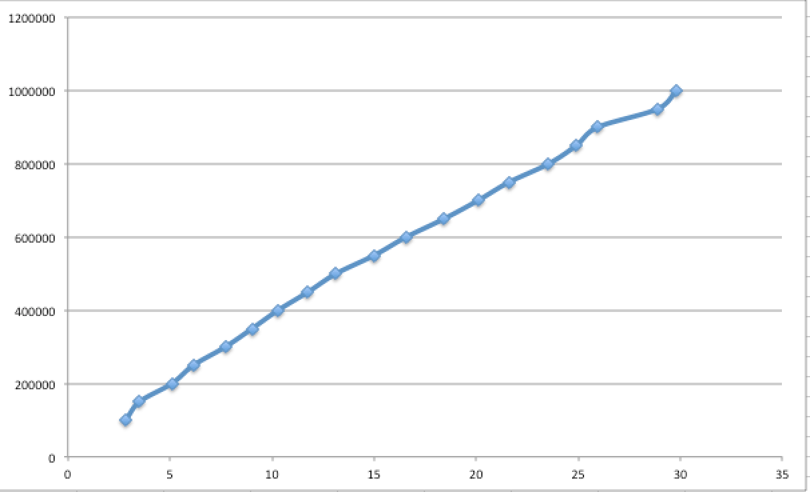
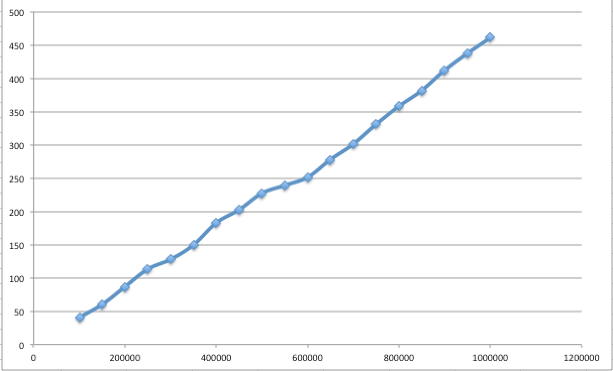
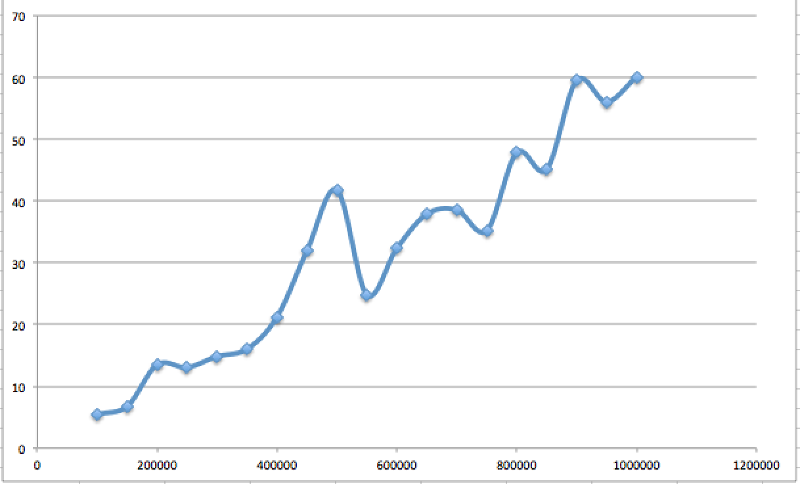
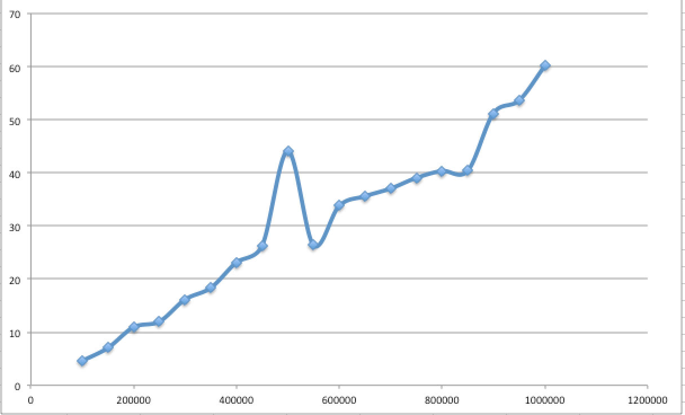

# Algorithmic Complexity

## Algorithms

`A process or set of rules to be followed in calculations or other problem-solving operations, especially by a computer.`

**input**

sequence of operations/steps that produce the desired outcome

**output**

- Language agnostic
- pseudo code
- idea under the code

`Series of steps and operations to get from one point to the desired outcome (input to output)`

## Complexity

`The amount of time, storage and/or other resources necessary to execute an algorithm`

- how many steps/iterations
- how slow (speed)
- memory usage

opposite of efficiency - want to try to decrease complexity

<!-- ## Github project -->

<!-- - timing code
- readme with plotted graphs - linking to algorithms
- folder of algorithms written -->

## Timing graphs (using performance.now in javascript)
### last (too many 0s making the graph weird)

### reverse

### shuffle (not an inbuilt function so found one to use)

### sort

## Timing graphs for my finding duplicates algorithm

### 20 times - average

In order to smooth this out I was advised to use median instead of average.  So.....

### 20 times - median

Still getting an odd spike around 45,000 - but it is much smoother
