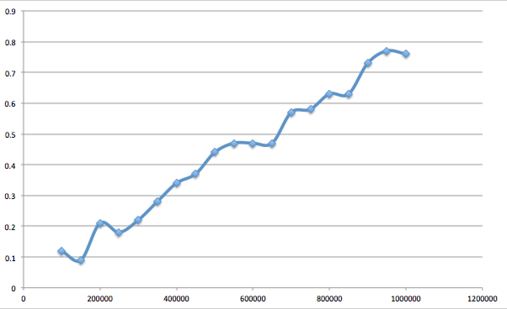
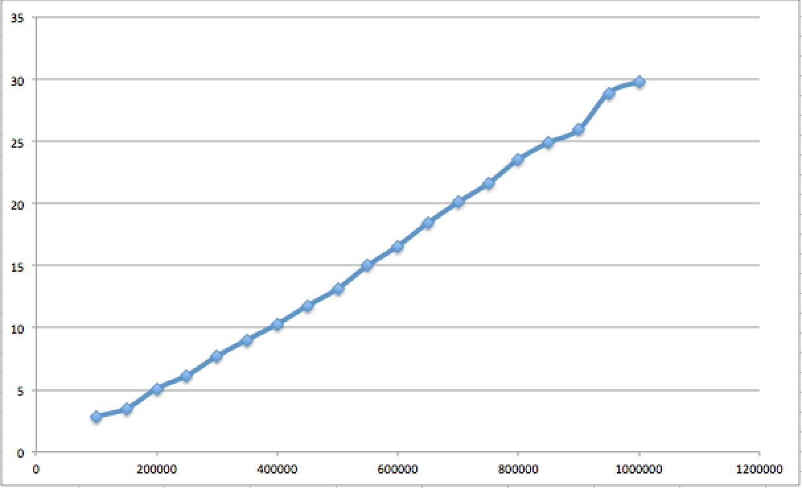

# Algorithmic Complexity

## Algorithms

`A process or set of rules to be followed in calculations or other problem-solving operations, especially by a computer.`

**input**

sequence of operations/steps that produce the desired outcome

**output**

- Language agnostic
- pseudo code
- idea under the code

`Series of steps and operations to get from one point to the desired outcome (input to output)`

## Complexity

`The amount of time, storage and/or other resources necessary to execute an algorithm`

- how many steps/iterations
- how slow (speed)
- memory usage

opposite of efficiency - want to try to decrease complexity

<!-- ## Github project -->

<!-- - timing code
- readme with plotted graphs - linking to algorithms
- folder of algorithms written -->

## Timing graphs (using performance.now in javascript)
### last (too many 0s making the graph weird)

### reverse

### shuffle (not an inbuilt function so found one to use)

### sort

## My own algorithms

### Finding duplicates algorithm

Given a list of words, find all words that appear more than once.

#### 20 times - average - using an object to store new list

In order to smooth this out I was advised to use median instead of average.  So.....

#### 20 times - median - using an object to store new list

Still getting an odd spike around 45,000 - but it is much smoother

#### 20 times - median - array length from 10,000 to 100,000

#### 20 times - median - after closing down processes

### Reverse algorithm

#### 20 times - median - reverse iterating through array

using a reverse iterating through the array - so i=final index down to i=0

#### 20 times - median - using map

This is the best one - kind of linear - the jump around 65k array items may be due to the way JavaScript is handled in Chrome.  I tried running in Firefox but it rounds up performance.now() to the nearest millisecond so couldn't get decent results in order to graph it.  I wasn't seeing an obvious jump though which leads me to think it's a Chromium thing (also does it in Opera which is based on Chromium)

#### 20 times - median - using push and pop

### Sorting 1s and 0s algorithm

**Sorting 0s and 1s**

Given an array containing only 0s and 1s, sort it.

#### 20 times - median - new array

This one is creating new array and putting the number at the start or end.  Trying with a slightly different method of updating the existing array

#### 20 times - median - same array

same curve but **MUCH** slower

### 20 times - median - using filters

LINEAR!!!

### Return top 10 frequency algorithm

**Most frequent words**

Given a text, find which are the ten most common words.

#### 20 times - median - using a for loop

#### 20 times - median - using reduce

Slower but a smoother line

### Quadratic Sort - insertion

#### 20 times - median

As expected - a quadratic graph

### Quadratic Sort - bubble

#### 20 times - median

As expected - a quadratic graph

### Quick Sort

#### 20 times - median

<!-- No recursion at the moment -->
